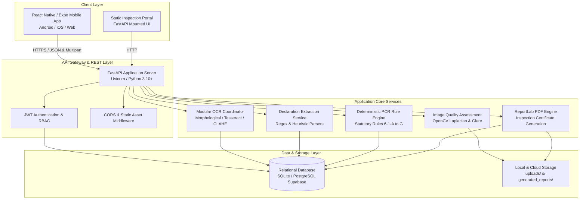
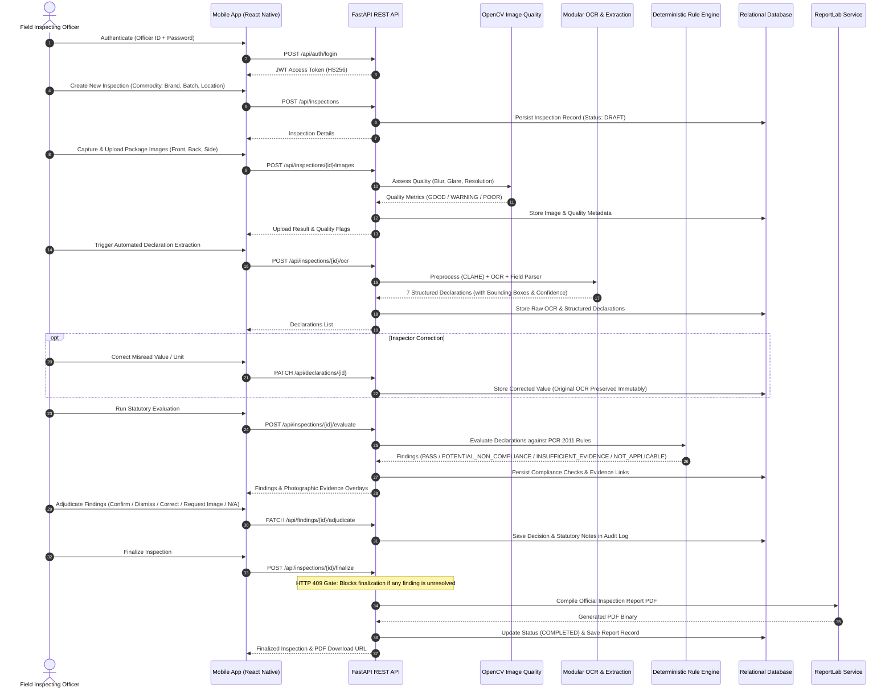
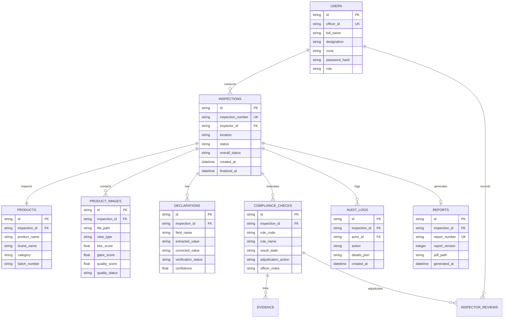

# NiriKsha — System Architecture & Technical Design

> **NiriKsha — SIH Prototype 2026 (For demonstration and evaluation purposes only)**

---

## 1. System Overview

**NiriKsha** is an AI-assisted legal metrology inspection and compliance decision-support system designed to evaluate packaged commodities against statutory declaration standards under the **Legal Metrology (Packaged Commodities) Rules, 2011 (PCR 2011)**.

The system enforces a **statutory safety principle**: AI and computer vision are strictly restricted to assistive roles (image ingestion, image quality assessment, text recognition, and structured field extraction). All legal compliance determinations and enforcement decisions are executed by a **deterministic statutory rule engine** coupled with a **human-in-the-loop inspector adjudication workflow**.

---

## 2. High-Level Architecture

---

## 3. End-to-End Inspection Pipeline

---

## 4. Component Deep Dives

### 4.1 Mobile Application (`mobile/`)
- **Framework**: React Native 0.74.5 with Expo SDK 51.
- **Language**: TypeScript (`tsconfig.json` with strict mode enabled).
- **Navigation**: Native Stack Navigator (`@react-navigation/native-stack`) managing authenticated officer flows.
- **State & Storage**: `expo-secure-store` for JWT persistence, `expo-file-system` and `expo-sharing` for report caching and PDF distribution.
- **Offline Drafts**: Local state management allowing inspection registration in offline or low-connectivity retail environments.

### 4.2 REST API & Gateway (`backend/main.py`)
- **Framework**: FastAPI with asynchronous endpoints.
- **Security**: OAuth2 Bearer scheme with JWT (HS256) signature verification and bcrypt password hashing.
- **Error Handling**: Standardized HTTP status codes with structured error payloads (`401` Unauthorized, `404` Not Found, `409` Conflict / Unresolved Findings Gate, `422` Validation Error).
- **CORS**: Configured for cross-origin local development and mobile network connectivity.

### 4.3 Image Quality Assessment (`backend/image_quality.py`)
- **Blur Detection**: Calculates the variance of the Laplacian operator on grayscale package images. Scores below the threshold indicate motion or focus blur.
- **Glare & Exposure Analysis**: Computes pixel luminance percentiles (95th and 5th percentiles) to detect specular reflection on glossy laminate packaging or underexposed low-light captures.
- **Dimension Check**: Validates minimum resolution requirements (800x600 px) to ensure sufficient DPI for optical character extraction.

### 4.4 OCR & Declaration Extraction (`backend/ocr_service.py`, `backend/extraction_service.py`)
- **Image Preprocessing**: Non-destructive CLAHE (Contrast Limited Adaptive Histogram Equalization) on a derived image copy.
- **Text Region Detection**: Morphological rectangular dilation kernels `(20, 3)` merge character contours into horizontal text line bounding boxes `[x1, y1, x2, y2]`.
- **Statutory Extraction**: Heuristic and regular expression parsing maps raw OCR text blocks to 7 mandatory declaration fields defined under Rule 6(1) of PCR 2011.

### 4.5 Deterministic Rule Engine (`backend/rule_engine/`)
The rule engine evaluates structured declarations against codified statutory logic without non-deterministic LLM variance.

| Statutory Rule | Code | Requirement |
|---|---|---|
| **Rule 6(1)(a)** | `PCR_RULE_06_1_A` | Name and complete address of the Manufacturer, Packer, or Importer. |
| **Rule 6(1)(b)** | `PCR_RULE_06_1_B` | Country of Origin for imported commodities. |
| **Rule 6(1)(c)** | `PCR_RULE_06_1_C` | Net Quantity in standard metric SI units (`g`, `kg`, `ml`, `l`, `m`, `cm`, `number/units`). |
| **Rule 6(1)(d)** | `PCR_RULE_06_1_D` | Month and Year of manufacture, packing, or import. |
| **Rule 6(1)(e)** | `PCR_RULE_06_1_E` | Maximum Retail Price (MRP) formatted with statutory tax qualifier ("inclusive of all taxes" / "incl. of all taxes"). |
| **Rule 6(1)(f)** | `PCR_RULE_06_1_F` | Common or generic name of the packaged commodity. |
| **Rule 6(1)(g)** | `PCR_RULE_06_1_G` | Consumer care details (name/designation, address, telephone number, email). |

### 4.6 Statutory Report Generation (`backend/report_service.py`)
- **Engine**: ReportLab PDF library.
- **Output**: Formal Inspection Certificate PDF including:
  - Inspection metadata (Number, Date, Officer ID, Location, Commodity Details)
  - Statutory findings table with rule references, extracted values, and compliance states
  - Photographic evidence block showing cropped package labels and bounding boxes
  - Inspector adjudication actions, notes, and digital sign-off
  - Official statutory disclaimer stating the advisory and decision-support nature of the system

---

## 5. Database Schema & Relationships

