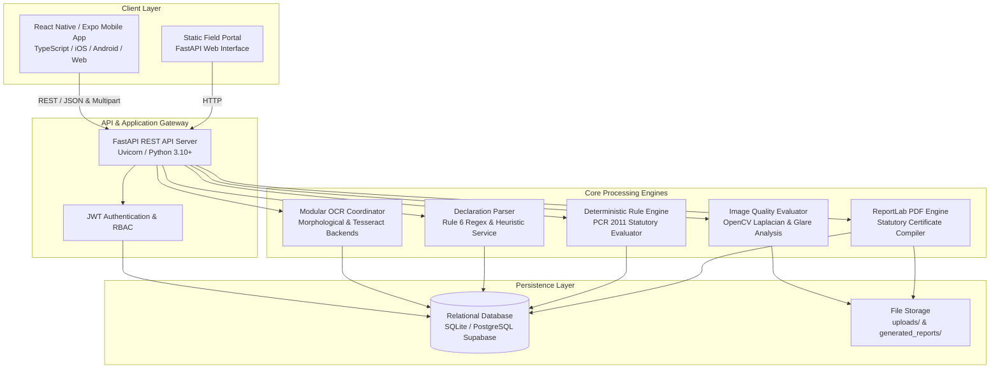
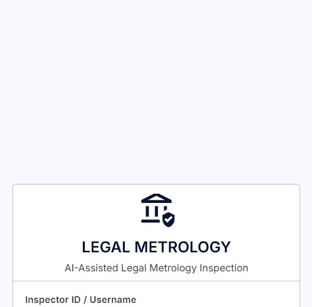
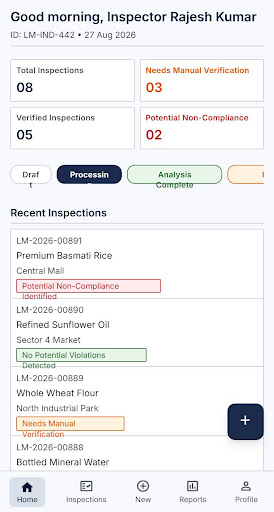
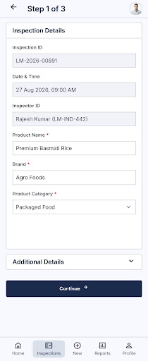
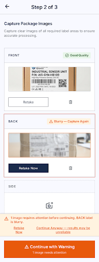
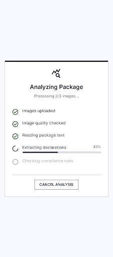
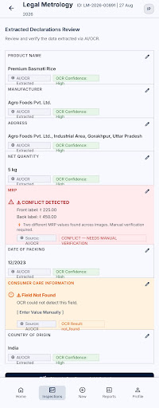
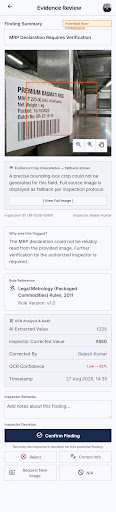
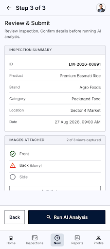
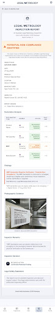

# AI-Assisted Legal Metrology Inspection & Compliance System

**Smart India Hackathon (SIH) 2026 • Problem Statement ID: 26034**  
**Ministry**: Ministry of Consumer Affairs, Food & Public Distribution  
**Department**: Department of Consumer Affairs (DoCA)  
**Category**: Software System to Check Compliance of Packaged Commodities under Legal Metrology (Packaged Commodities) Rules, 2011  
> **SIH 2026 Prototype — For demonstration purposes only.**

---

## Documentation Quick Links

- [System Architecture & Technical Design](docs/architecture.md)
- [Environment Setup & Installation Guide](docs/setup.md)
- [REST API Reference](docs/api.md)
- [Automated Testing & Verification Guide](docs/testing.md)

---

## Overview

The **AI-Assisted Legal Metrology Inspection & Compliance System** is a software prototype developed for field enforcement officers to inspect packaged commodities against statutory declaration standards mandated by the **Legal Metrology (Packaged Commodities) Rules, 2011 (PCR 2011)** under the **Legal Metrology Act, 2009**.

The platform combines mobile image capture, OpenCV-based image quality assessment, modular optical character recognition (OCR), and structured field extraction with a **deterministic statutory rule engine**.

To preserve statutory safety and legal enforceability, the system strictly isolates artificial intelligence to an assistive role (ingestion, quality checks, character recognition, and field parsing). All legal compliance evaluations are executed by deterministic codified statutory logic, and all findings require review and adjudication by a human inspecting officer before an official inspection certificate is compiled.

---

## Problem Statement

Field enforcement officers conducting retail market surveillances face significant challenges when inspecting packaged commodities:

1. **Manual Inspection Bottlenecks**: Manually verifying mandatory label declarations across hundreds of retail Stock Keeping Units (SKUs) is time-consuming and error-prone.
2. **Statutory Complexity**: The Legal Metrology (Packaged Commodities) Rules, 2011 mandate specific declaration formats for manufacturer details, net quantities (in metric SI units), maximum retail prices (with tax qualifiers), manufacturing dates, and consumer grievance details.
3. **Evidentiary Integrity**: Traditional inspections often lack immutable digital audit trails linking photographic packaging evidence to specific statutory non-compliance citations, complicating legal compounding and adjudication proceedings.

---

## Solution

The implemented prototype provides a structured, digital inspection workflow:

- **Mobile Data Capture**: Inspecting officers record commodity metadata, category, brand, and batch numbers, and capture multi-panel packaging photographs directly in the field.
- **Image Quality Gate**: Automated OpenCV algorithms evaluate blur, glare, and resolution before optical extraction to prevent false negatives caused by unreadable imagery.
- **Structured Field Extraction**: OCR text regions are parsed into 7 statutory declaration fields under Rule 6(1).
- **Deterministic Rule Engine**: Declarations are evaluated against codified statutory rules, classifying each check as `PASS`, `POTENTIAL_NON_COMPLIANCE`, `INSUFFICIENT_EVIDENCE`, or `NOT_APPLICABLE`.
- **Human-in-the-Loop Adjudication**: Officers review evidence overlays and choose from 5 standardized adjudication actions (`Confirm`, `Dismiss`, `Correct`, `Request New Image`, `Not Applicable`).
- **Statutory Finalization Gate**: The backend blocks report generation (HTTP 409) if any potential finding remains unadjudicated.
- **Automated PDF Inspection Certificates**: ReportLab generates a multi-page inspection report with embedded evidence photographs, bounding box crops, officer decisions, and an immutable audit log.

---

## Key Features (Implemented & Validated)

- **OpenCV Image Quality Assessment**: Evaluates Laplacian variance (blur detection), specular luminance percentiles (glare detection), and dimension thresholds.
- **Modular OCR & Declaration Extraction**: Preprocesses images with CLAHE and extracts text line bounding boxes, mapping raw text to 7 mandatory Rule 6 declarations.
- **Deterministic Statutory Rule Engine**: Evaluates statutory rules (Rules 6(1)(a) through 6(1)(g)) without non-deterministic LLM variance.
- **Evidence-Linked Findings**: Maps every compliance finding directly to cropped photographic packaging evidence and bounding box coordinates.
- **Human-in-the-Loop Inspector Adjudication**: Supports 5 distinct officer actions:
  - `CONFIRM`: Validates potential non-compliance and records statutory notes.
  - `DISMISS`: Dismisses finding with documented statutory justification.
  - `CORRECT`: Corrects OCR extraction while immutably preserving the baseline OCR value.
  - `REQUEST_NEW_IMAGE`: Retains finding under `NEEDS_MORE_EVIDENCE` and requests re-capture.
  - `NOT_APPLICABLE`: Marks rule non-applicable based on commodity classification.
- **Unresolved-Finding Finalization Gate**: HTTP 409 Conflict protection prevents closing inspections with pending findings.
- **Immutable Data & Audit Trail**: Preserves original OCR extractions separately from officer corrections and logs all lifecycle actions with timestamps and officer IDs.
- **Automated ReportLab PDF Generation**: Compiles formal inspection reports including product metadata, findings tables, photographic evidence, and required statutory disclaimers.
- **Offline Draft Workflow**: Allows field officers to register inspection records offline and sync when network connectivity is restored.

---

## Statutory Inspection Workflow

```
Product / Label Image Capture
           ↓
Image Quality Assessment (Blur, Glare, Resolution)
           ↓
Modular OCR & Bounding Box Localization
           ↓
Structured Declaration Extraction (Rule 6 Fields)
           ↓
Inspector Declaration Review & Correction
           ↓
Deterministic Legal Metrology Rule Engine
           ↓
Inspector Adjudication (Confirm / Dismiss / Correct / Re-image / N/A)
           ↓
Finalization Gating (HTTP 409 on Unresolved Findings)
           ↓
Automated Statutory PDF Inspection Certificate
```

---

## System Architecture



---

## Technology Stack

| Layer | Technology | Purpose in System |
|---|---|---|
| **Mobile Client** | React Native 0.74.5, Expo SDK 51, TypeScript | Cross-platform mobile inspection application for field officers. |
| **Backend API** | Python 3.10+, FastAPI, Uvicorn, Pydantic v2 | High-performance asynchronous REST API and service coordination. |
| **Database** | SQLAlchemy 2.0, SQLite (Local Dev), PostgreSQL / Supabase | Relational data persistence with 12 structured models and audit logging. |
| **Computer Vision** | OpenCV (cv2), NumPy | Laplacian blur detection, glare percentile analysis, CLAHE enhancement. |
| **OCR & Extraction** | Morphological text segmenter, Tesseract fallback | Text bounding box localization and Rule 6 structured field extraction. |
| **Rule Engine** | Codified Python statutory engine | Deterministic compliance evaluation for PCR 2011 Rules 6(1)(a)–(g). |
| **Authentication** | JWT (python-jose), bcrypt | HS256 token issuance and salted password hashing. |
| **Report Generation** | ReportLab | Enforcement-grade multi-page inspection report PDF compiler. |
| **Automated Testing** | Pytest, FastAPI TestClient, pypdf | 77 automated unit, lifecycle, statutory, and end-to-end integration tests. |

---

## Application Screenshots

The screenshots below illustrate the implemented mobile application workflow:

### 1. Authentication & Dashboard
| Login Screen | Inspector Dashboard |
|:---:|:---:|
|  |  |

### 2. Inspection Registration & Image Quality
| New Inspection Registration | Quality Warning & Guidance |
|:---:|:---:|
|  |  |

### 3. OCR Extraction & Declarations
| Processing Pipeline | Extracted Declarations Review |
|:---:|:---:|
|  |  |

### 4. Statutory Compliance Findings & Evidence
| Statutory Rule Findings | Evidence Review & Cropped Overlays |
|:---:|:---:|
|  |  |

### 5. Finalization & Official Inspection Report
| Review & Submit | Inspection Report Preview |
|:---:|:---:|
|  |  |

---

## Installation & Setup

### Prerequisites
- **Python 3.10+** (`python --version`)
- **Node.js 18.x or 20.x** & **npm** (`node --version`, `npm --version`)
- **Git**

### Backend Setup

```bash
# 1. Clone repository
git clone https://github.com/ankeshbit/SIH.git
cd SIH

# 2. Create and activate virtual environment
# Windows PowerShell:
python -m venv venv
.\venv\Scripts\Activate.ps1

# macOS / Linux:
# python3 -m venv venv
# source venv/bin/activate

# 3. Install dependencies
pip install -r backend/requirements.txt

# 4. Copy environment template (configured for zero-setup local SQLite by default)
# Windows:
Copy-Item .env.example .env
# Linux/macOS: cp .env.example .env

# 5. Start FastAPI application server
python -m uvicorn backend.main:app --host 127.0.0.1 --port 8000 --reload
```

Backend endpoints:
- **OpenAPI Interactive Documentation**: [http://127.0.0.1:8000/docs](http://127.0.0.1:8000/docs)
- **Health Check**: [http://127.0.0.1:8000/api/health](http://127.0.0.1:8000/api/health)

### Mobile Application Setup

```bash
# 1. Navigate to mobile directory
cd mobile

# 2. Install dependencies
npm install

# 3. Verify TypeScript type safety
npm run ts:check

# 4. Start Expo development server
npm run start
```

Press `w` in the Expo terminal to launch in web mode, or scan the QR code using Expo Go on Android.

---

## Demonstration Credentials

A pre-seeded demonstration inspector account is available in `backend/seed.py`:

| Role | Officer ID | Password | Designation | Zone |
|---|---|---|---|---|
| **Field Inspecting Officer** | `DOCA-INSP-842` | `admin123` | Senior Inspector (Legal Metrology) | Northern Zone - Delhi HQ |

---

## Automated Testing & Verification

The codebase includes **77 automated tests** with 100% pass rate:

```bash
# Run complete test suite (Windows PowerShell)
$env:DATABASE_URL="sqlite:///./legal_metrology.db"
.\venv\Scripts\python.exe -m pytest tests/ -v -W ignore::starlette.exceptions.StarletteDeprecationWarning

# Run QA hardening audit
.\venv\Scripts\python.exe -m tests.qa_hardening_audit

# Run mobile TypeScript check
cd mobile
npm run ts:check
```

**Verified Test Metrics**:
- Pytest Suite: **77 / 77 Passed (100%)**
- TypeScript Diagnostic: **0 Errors (`tsc --noEmit`)**

---

## Project Structure

```text
.
├── .env.example               # Sanitized environment configuration template
├── .gitignore                  # Git ignore rules for virtualenvs, caches, binaries
├── LICENSE                     # MIT License
├── README.md                   # Primary project documentation
│
├── backend/                    # FastAPI Backend Application
│   ├── rule_engine/            # Deterministic PCR 2011 Statutory Rule Engine
│   │   ├── engine.py           # Codified statutory rule evaluation algorithms
│   │   ├── models.py           # Rule and finding data schemas
│   │   └── registry.py         # Statutory rules metadata registry (Rules 6(1)(a)-(g))
│   ├── auth_service.py         # JWT token issuance and OAuth2 verification
│   ├── auth_utils.py           # Bcrypt password hashing
│   ├── config.py               # Pydantic BaseSettings application configuration
│   ├── database.py             # SQLAlchemy session and connection pooler management
│   ├── extraction_service.py   # Rule 6 statutory field extraction parsers
│   ├── image_quality.py        # OpenCV blur, glare, and resolution assessment
│   ├── main.py                 # FastAPI application routes and lifecycle hooks
│   ├── models.py               # 12 SQLAlchemy ORM models and relationships
│   ├── ocr_service.py          # Modular OCR coordinator (Morphological / Tesseract)
│   ├── report_service.py       # ReportLab statutory inspection certificate generator
│   ├── requirements.txt        # Backend Python dependencies
│   ├── schemas.py              # Pydantic request/response validation schemas
│   └── seed.py                 # Database initialization and demo officer seed
│
├── mobile/                     # React Native / Expo Mobile Application
│   ├── assets/                 # Mobile icons, splash screen, and imagery
│   ├── src/
│   │   ├── components/         # Reusable UI components (AppHeader, MetricCard, StatusBadge)
│   │   ├── navigation/         # Native stack navigator and route type definitions
│   │   ├── screens/            # 13 complete workflow screens
│   │   ├── services/           # REST API client and secure storage managers
│   │   └── theme/              # Typography, color tokens, and styling constants
│   ├── app.json                # Expo configuration manifest
│   ├── package.json            # Node dependencies and scripts
│   └── tsconfig.json           # TypeScript configuration
│
├── tests/                      # Automated Test Suite (77 Tests)
│   ├── fixtures/               # Test image assets (clear, blurry, dark, multi-panel)
│   ├── qa_hardening_audit.py   # 10-step end-to-end integration audit runner
│   ├── test_e2e_mobile_workflow.py # Full mobile lifecycle and adjudication tests
│   ├── test_final_corrections.py   # HTTP 409 gate and 5 adjudication action tests
│   ├── test_foundation.py      # Health check, authentication, and static route tests
│   ├── test_phase2.py          # Inspection creation, sorting, and dashboard tests
│   ├── test_phase3.py          # Image upload, MIME gating, and OpenCV quality tests
│   ├── test_phase4.py          # OCR execution, field extraction, and patch tests
│   ├── test_phase5.py          # Deterministic statutory rule engine evaluation tests
│   └── test_phase6.py          # Inspector adjudication and ReportLab PDF tests
│
├── database/
│   └── schema.sql              # Base PostgreSQL / SQLite DDL schema
│
├── docs/                       # Project Technical Documentation
│   ├── architecture.md         # Detailed architectural design and sequence diagrams
│   ├── setup.md                # Development environment setup and installation guide
│   ├── api.md                  # REST API reference and endpoint specifications
│   ├── testing.md              # Automated testing catalog and verification guide
│   ├── prd/                    # Product requirements and specification documents
│   └── screenshots/            # Curated application screenshot gallery
│
├── scripts/                    # Helper and build utility scripts
│   ├── setup_android_sdk.py    # Local Android commandlinetools setup utility
│   └── download_screens.js     # UI screen download utility
│
├── generated_reports/          # Storage directory for compiled inspection PDFs
└── uploads/                    # Storage directory for captured packaging images
```

---

## Security & Configuration

- **Environment Isolation**: Live secrets and database connection strings are kept in `.env` (excluded from version control via `.gitignore`).
- **Cryptographic Password Hashing**: Officer passwords are stored using bcrypt salted hashes.
- **Stateless Authentication**: API requests are authenticated using short-lived JWT tokens signed with HS256.
- **CORS Protection**: CORS middleware is explicitly defined to restrict unauthorized origins.
- **Input Validation**: All API inputs are strictly validated against Pydantic models.

---

## Current Status

The project is an **SIH 2026 MVP prototype**. The implemented inspection workflow has been validated through automated backend tests and TypeScript checks and is intended for demonstration and evaluation.

---

## Limitations

As an evaluation prototype, the system has the following documented boundaries:

1. **Rule 9 Font Height Measurement Exclusion**: The MVP excludes automated millimeter font height measurement (Rule 9 / Table 1). Accurately determining millimeter font dimensions from uncalibrated smartphone camera photos without a physical scale target remains in research.
2. **Network Dependency for Cloud Database**: While the local SQLite mode operates entirely offline, cloud Supabase synchronization requires internet connectivity.
3. **Lighting & Package Geometry**: Extreme glare on high-gloss curved packaging may trigger quality warnings requiring inspector adjustment.
4. **Statutory Advisory Role**: The software serves strictly as an **AI-assisted decision-support system**. Final legal compounding, notices, and statutory enforcement actions remain under the authority of the human inspecting officer.

---

## Future Scope

- **Hardware-Assisted Physical Calibration**: Incorporating AR-based or scale-target camera calibration for automated Rule 9 font height measurements.
- **Batch Market Surveillance Analytics**: Centralized administrative dashboard aggregating non-compliance trends across districts and commodity categories.
- **Multi-Language Declaration Extraction**: Expanding OCR parsers to extract mandatory regional language declarations under Rule 6(3).
- **On-Device Edge OCR**: Porting OCR inference directly to on-device mobile neural runtimes (e.g. TensorFlow Lite / ONNX) for fully disconnected field execution.

---

## License

This project is licensed under the [MIT License](LICENSE).
