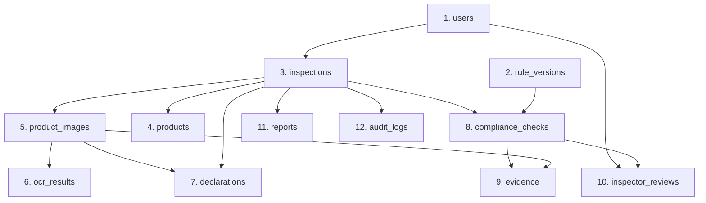

# NiriKsha — SQLite to PostgreSQL Data Migration Plan

**Date**: September 8, 2026  
**Source Database**: `legal_metrology.db` (SQLite, 348,160 bytes, 227 rows)  
**Target Database**: Neon PostgreSQL (`postgresql+psycopg://...`)  
**Rollback Safeguard**: `legal_metrology.db.pre_remediation_backup` + original `legal_metrology.db` remain 100% untouched.

---

## 1. Migration Classification & Row Breakdown

| Table | SQLite Rows | Rows To Migrate | Reason |
| :--- | :---: | :---: | :--- |
| `users` | 1 | 1 | Official seed inspector account (`DOCA-INSP-842` / Inspector Rajesh Sharma). Essential for production authentication. |
| `rule_versions` | 9 | 9 | Statutory Legal Metrology (Packaged Commodities) Rules, 2011 rule definitions (MRP, Net Qty, Manufacturer, Date, Consumer Care, Commodity Name, Country of Origin) + data quality rules. |
| `inspections` | 4 | 1 | Preserve legitimate reference inspection `LM-2026-00001` (`Himalayan Organic Oats`, Sector 4 Market, COMPLETED, Report v3 exists). Exclude test draft contamination `LM-2026-00002` (`hvhv`), `LM-2026-00003` (`sdfsd`), and `LM-2026-00004` (`dscdscd`). |
| `products` | 4 | 1 | Preserve product record for `LM-2026-00001` (`Himalayan Organic Oats`). Exclude test products for `LM-2026-00002..00004`. |
| `product_images` | 9 | 2 | Preserve front and back label evidence images for `LM-2026-00001`. Exclude 7 leftover test images from non-reference inspections. |
| `ocr_results` | 9 | 2 | Preserve genuine OCR extraction records and bounding boxes for `LM-2026-00001` images. Exclude 7 test OCR outputs. |
| `declarations` | 21 | 7 | Preserve verified statutory declarations for `LM-2026-00001`. Exclude 14 unfinalized test declarations. |
| `compliance_checks` | 36 | 9 | Preserve deterministic rule engine evaluation findings for `LM-2026-00001`. Exclude 27 test checks. |
| `evidence` | 33 | 8 | Preserve photographic crop and bounding box evidence linked to `LM-2026-00001` compliance checks. Exclude 25 test evidence items. |
| `inspector_reviews` | 9 | 9 | Preserve official officer review remarks and adjudications for `LM-2026-00001` findings. |
| `reports` | 1 | 1 | Preserve official statutory inspection report v3 (`LM_Report_LM_2026_00001_v3.pdf`) for `LM-2026-00001`. |
| `audit_logs` | 91 | 76 | Preserve 18 audit log events belonging to `LM-2026-00001` + 58 system/officer authentication and startup events. Exclude 15 logs from aborted test drafts. |
| **TOTAL** | **227** | **126** | **Zero test contamination migrated. All legitimate statutory records preserved.** |

---

## 2. Topological Insertion Order (Foreign Key DAG)

Because PostgreSQL enforces foreign key constraints strictly, tables must be populated in exact dependency order:

1. **`users`** (Primary keys: `id`)
2. **`rule_versions`** (Primary keys: `id`, unique: `rule_code`)
3. **`inspections`** (FK: `inspector_id` → `users.id`)
4. **`products`** (FK: `inspection_id` → `inspections.id`)
5. **`product_images`** (FK: `inspection_id` → `inspections.id`)
6. **`ocr_results`** (FK: `image_id` → `product_images.id`)
7. **`declarations`** (FK: `inspection_id` → `inspections.id`, `source_image_id` → `product_images.id`)
8. **`compliance_checks`** (FK: `inspection_id` → `inspections.id`, `rule_version_id` → `rule_versions.id`)
9. **`evidence`** (FK: `check_id` → `compliance_checks.id`, `image_id` → `product_images.id`)
10. **`inspector_reviews`** (FK: `check_id` → `compliance_checks.id`, `officer_id` → `users.id`)
11. **`reports`** (FK: `inspection_id` → `inspections.id`)
12. **`audit_logs`** (FK: `inspection_id` → `inspections.id`)

---

## 3. Data Transformation & Type Conversion Invariants

During migration from SQLite to PostgreSQL:
1. **Datetime Parsing**: String timestamps like `'2026-09-04 18:53:09.445012'` are parsed via `datetime.fromisoformat()` into timezone-naive Python `datetime` objects.
2. **Boolean Normalization**: SQLite integer values `0` and `1` for `is_active` and `is_applicable` are converted to Python `False` and `True`.
3. **UUID Integrity**: All 36-character UUID strings are preserved identically.
4. **Relationship Verification**: Before committing each batch, assert foreign key references resolve to migrated parents.
5. **Rollback Guarantee**: All operations execute within a single PostgreSQL database transaction. If any error occurs, the transaction rolls back completely, leaving the target clean.
