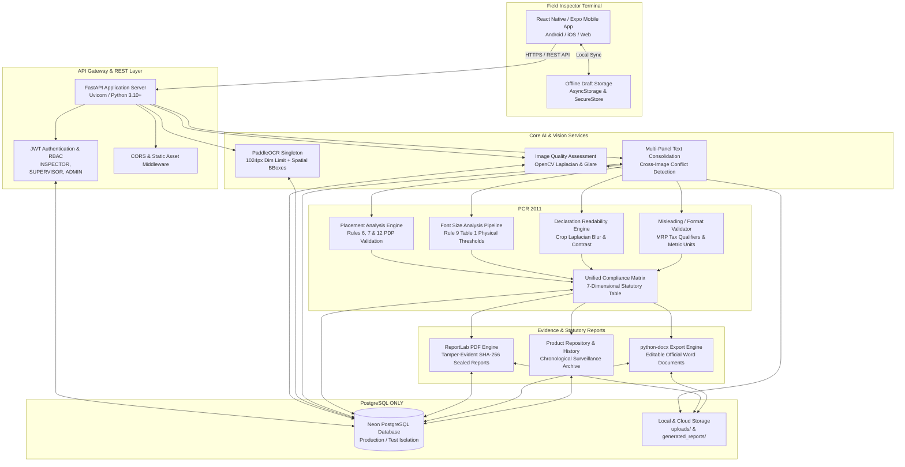
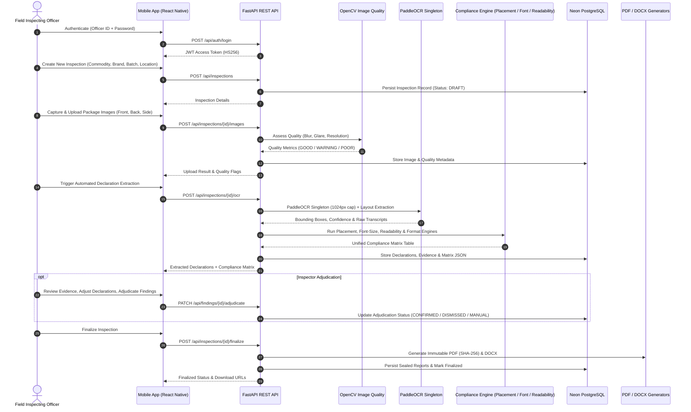

# NiriKsha — System Architecture & Technical Design

> **NiriKsha — SIH Prototype 2026 (Problem Statement 26034)**  
> *“Software System to check compliance of Packaged Commodities under Legal Metrology (Packaged Commodities) Rules, 2011 by scanning products, images and labels.”*

---

## 1. System Overview

**NiriKsha** is an AI-assisted legal metrology inspection and compliance decision-support system designed to evaluate packaged commodities against statutory declaration standards under the **Legal Metrology (Packaged Commodities) Rules, 2011 (PCR 2011)**.

The system enforces a **statutory safety principle**: AI and computer vision are strictly restricted to assistive roles (image ingestion, image quality assessment, text recognition, spatial coordinate detection, and structured field extraction). All legal compliance determinations and enforcement decisions are executed by a **deterministic statutory rule engine** coupled with a **human-in-the-loop inspector adjudication workflow**.

---

## 2. Technology Stack & Database Invariants

- **Field Inspector Mobile Client:** React Native + Expo + TypeScript (Android / iOS / Web).
- **Backend API Gateway:** FastAPI (Python 3.10+) running with Uvicorn.
- **Database Engine (STRICT INVARIANT):**
  - **Production:** Neon PostgreSQL (Cloud-native serverless PostgreSQL with TLS encryption).
  - **Testing:** Dedicated separate Neon PostgreSQL test database.
  - **SQLite:** **STRICTLY FORBIDDEN** for application runtime and automated testing. Zero local `.db` files, zero in-memory SQLite instances.
- **OCR Engine:** PaddleOCR CPU singleton (1024px dimension cap) with Tesseract fallback where configured.
- **Computer Vision:** OpenCV (Laplacian blur variance, luminance contrast analysis).
- **Report Engines:**
  - ReportLab (Formal sealed statutory PDF reports with SHA-256 integrity hash).
  - python-docx (Editable statutory Word reports with evidence plates).

---

## 3. High-Level Architecture Diagram

---

## 4. End-to-End Inspection Pipeline

---

## 5. Compliance Engine Modules (PCR 2011)

1. **Placement Analysis (`backend/placement_service.py`):**  
   Evaluates Principal Display Panel (PDP) placement for Net Quantity and Commodity Name under Rules 6, 7 & 12. Distinguishes front PDP from information panels.
2. **Font-Size Analysis (`backend/font_size_service.py`):**  
   Evaluates character height against Rule 9 Table 1 thresholds (1.0mm, 2.0mm, 4.0mm, 6.0mm). Strictly enforces anti-fabrication: without physical calibration, returns `FONT_SIZE_UNDETERMINABLE` rather than guessing millimeters from pixels.
3. **Declaration Readability (`backend/readability_service.py`):**  
   Measures localized bounding box blur variance and contrast. Never converts observation defects or low confidence into automatic legal violations.
4. **Format & Misleading Validation (`backend/declaration_validation_service.py`):**  
   Validates mandatory statutory qualifiers (e.g. MRP "inclusive of all taxes", SI metric units, date plausibility, and consumer care channels).
5. **Unified Declaration Compliance Matrix:**  
   Generates a 7-dimensional compliance table displayed on the mobile terminal and statutory reports.

---

## 6. Security, RBAC & Immutability

- **Role-Based Access Control:** Field Inspectors are isolated to their own inspections. Supervisors and Admins possess audit and cross-district surveillance access.
- **Report Immutability:** Finalized reports are sealed with SHA-256 integrity hashes. Once generated, reports cannot be altered or deleted.
- **Database Safety Guard:** Hard safety guards in test configurations immediately terminate any destructive operations if the test database hostname or database matches production.
